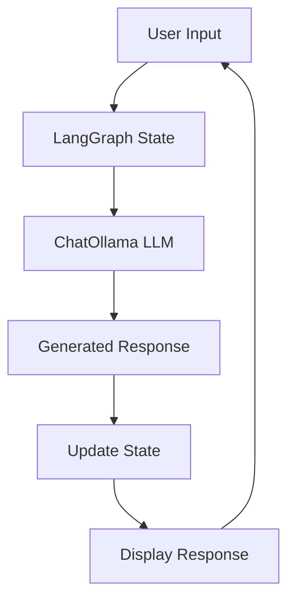

# 🤖 agent007 — General-Purpose AI Chatbot

[](https://opensource.org/licenses/MIT)
[](https://www.python.org/downloads/)
[](https://ollama.com/)

**agent007** is a fast, offline-first AI chatbot built using [LangGraph](https://github.com/langchain-ai/langgraph) and [Ollama](https://ollama.com/). It runs entirely on your local machine and responds to general-purpose prompts using stateful conversational logic.

---

## 📄 Third-Party Licenses

This project uses the following open-source libraries:

### LangChain & LangGraph
- **License**: MIT License
- **Copyright**: © 2022 Harrison Chase
- **Repository**: https://github.com/langchain-ai/langchain

### Ollama
- **License**: MIT License  
- **Copyright**: © 2023 Ollama Inc.
- **Repository**: https://github.com/ollama/ollama

### Python Libraries
All Python dependencies are licensed under permissive licenses (MIT, BSD, Apache 2.0).
Full license information can be found in each package's respective repository.

---

## 🚀 Features

- 💬 **General-purpose conversational AI** — handles a wide range of topics and queries
- 🔄 **Maintains short-term memory** for coherent, context-aware replies
- ⚡️ **Lightweight and fast** using local Ollama models
- 🧠 **Built with LangGraph** agent-based state machine architecture
- 🔒 **Privacy-first** — all processing happens locally, no data sent to external servers
- 🛠 **Simple to extend** with tools, memory, or RAG pipelines

---

## 📦 Requirements

- **Python 3.10+**
- **[Ollama](https://ollama.com)** installed and running
- At least **4GB RAM** (8GB+ recommended for larger models)
- One local model downloaded (e.g., `mistral`, `phi3`, `llama3`, or `gemma`)

---

## 📥 Installation

### 1. Clone the repository

```bash
git clone https://github.com/yourusername/agent_007.git
cd agent_007
```

### 2. Install dependencies

```bash
# Core LangChain and LangGraph dependencies
langchain>=0.1.0
langgraph>=0.0.40
langchain-community>=0.0.20
langchain-core>=0.1.0

# Ollama integration
ollama>=0.1.7

# Additional utilities
pydantic>=2.0.0
typing-extensions>=4.5.0


```

### 3. Start Ollama and load a model

```bash
# Start Ollama service
ollama serve

# Download and run a model (in a new terminal)
ollama pull mistral  # Download the model
ollama run mistral   # Test the model
```

**Available Models:**
- `mistral` (7B) - Balanced performance and speed
- `phi3` (3.8B) - Extremely lightweight
- `llama3` (8B) - High-performance LLM
- `gemma` (2B/7B) - Google's efficient model

---

## 💻 Usage

### Basic Usage

Start the chatbot from your terminal:

```bash
python agent007.py
```

Example conversation:

```
🤖 agent007 - General-Purpose AI Chatbot
Powered by LangGraph + Ollama | Type 'exit' to quit

You: What is the capital of France?
AI: The capital of France is Paris. It's also the largest city in France and serves as the country's political, economic, and cultural center.

You: Tell me something interesting about it.
AI: Paris is known as the "City of Light" not just because it was an early adopter of street lighting, but also because it became a center of education and ideas during the Age of Enlightenment. The city has over 130 museums and monuments, including the famous Louvre, which houses the Mona Lisa!

You: exit
Goodbye! 👋
```

### Configuration

You can customize the model and settings by editing `agent_007.py`:

```python
# Change the model
llm_model = ChatOllama(model="phi3", temperature=0.7)

# Adjust creativity (0.0 = focused, 1.0 = creative)
llm_model = ChatOllama(model="mistral", temperature=0.9)
```

---

## 🧠 How It Works

1. **State Management**: Uses LangGraph to build a reactive state graph that maintains conversation context
2. **Message Processing**: Converts user input into `HumanMessage` objects
3. **LLM Integration**: Passes messages to Ollama through LangChain's `ChatOllama` interface
4. **Response Generation**: Model generates contextual responses based on conversation history
5. **State Updates**: Conversation state is updated and memory is maintained for follow-up questions



---

## 🧪 Supported Models

| Model | Size | Speed | Quality | Best For |
|-------|------|-------|---------|----------|
| `phi3` | 3.8B | ⚡⚡⚡ | ⭐⭐⭐ | Quick responses, low resource usage |
| `gemma:2b` | 2B | ⚡⚡⚡ | ⭐⭐ | Ultra-fast, minimal hardware |
| `mistral` | 7B | ⚡⚡ | ⭐⭐⭐⭐ | Balanced performance |
| `llama3` | 8B | ⚡ | ⭐⭐⭐⭐⭐ | Highest quality responses |

**Switch models easily:**

```python
# In agent_007.py
llm_model = ChatOllama(model="your-preferred-model", temperature=0.7)
```


---

## 🔧 Advanced Configuration

### Custom System Prompts

```python
# Add personality to your agent
system_prompt = """You are agent007, a helpful AI assistant with a friendly personality. 
You provide clear, concise answers while maintaining a conversational tone."""

llm_model = ChatOllama(
    model="mistral", 
    temperature=0.7,
    system=system_prompt
)
```

---

## 🚀 Performance Tips

- **GPU Acceleration**: Use `ollama run --gpu` for NVIDIA GPUs
- **Memory Usage**: Smaller models (phi3, gemma:2b) for resource-constrained systems
- **Response Speed**: Lower temperature values (0.1-0.3) for faster, more focused responses
- **Context Length**: Limit conversation history for better performance with long chats

---

## 📌 Roadmap

- [ ] 🛠 **Tool Integration** — Calculator, web search, file operations
- [ ] 📚 **RAG Pipeline** — PDF/document-based knowledge retrieval
- [ ] 🌐 **Web Interface** — Streamlit/Gradio UI for browser access
- [ ] 👤 **Persona System** — Multiple AI personalities and roles
- [ ] 💾 **Persistent Memory** — Long-term conversation storage
- [ ] 🔌 **Plugin Architecture** — Easy integration of custom tools
- [ ] 📊 **Analytics Dashboard** — Usage statistics and conversation insights

---

## 🤝 Contributing

Contributions are welcome! Please feel free to submit a Pull Request. For major changes, please open an issue first to discuss what you would like to change.

1. Fork the repository
2. Create your feature branch (`git checkout -b feature/AmazingFeature`)
3. Commit your changes (`git commit -m 'Add some AmazingFeature'`)
4. Push to the branch (`git push origin feature/AmazingFeature`)
5. Open a Pull Request

---

## 🐛 Troubleshooting

### Common Issues

**Ollama connection error:**
```bash
# Make sure Ollama is running
ollama serve

# Check if models are available
ollama list
```

**Model not found:**
```bash
# Pull the model first
ollama pull mistral
```

**Memory issues:**
- Try smaller models like `phi3` or `gemma:2b`
- Reduce conversation history length
- Close other applications to free RAM

---

## 🛡 License

This project is licensed under the **MIT License**.

```
MIT License

Copyright (c) 2025 agent007

Permission is hereby granted, free of charge, to any person obtaining a copy
of this software and associated documentation files (the "Software"), to deal
in the Software without restriction, including without limitation the rights
to use, copy, modify, merge, publish, distribute, sublicense, and/or sell
copies of the Software, and to permit persons to whom the Software is
furnished to do so, subject to the following conditions:

The above copyright notice and this permission notice shall be included in all
copies or substantial portions of the Software.

THE SOFTWARE IS PROVIDED "AS IS", WITHOUT WARRANTY OF ANY KIND, EXPRESS OR
IMPLIED, INCLUDING BUT NOT LIMITED TO THE WARRANTIES OF MERCHANTABILITY,
FITNESS FOR A PARTICULAR PURPOSE AND NONINFRINGEMENT. IN NO EVENT SHALL THE
AUTHORS OR COPYRIGHT HOLDERS BE LIABLE FOR ANY CLAIM, DAMAGES OR OTHER
LIABILITY, WHETHER IN AN ACTION OF CONTRACT, TORT OR OTHERWISE, ARISING FROM,
OUT OF OR IN CONNECTION WITH THE SOFTWARE OR THE USE OR OTHER DEALINGS IN THE
SOFTWARE.
```

---

## 🙏 Acknowledgements

- [LangGraph](https://github.com/langchain-ai/langgraph) - For the powerful agent framework
- [LangChain](https://github.com/langchain-ai/langchain) - For LLM integration capabilities  
- [Ollama](https://ollama.com/) - For making local LLM deployment simple and fast
- The open-source AI community for continuous innovation

---

## 📞 Support

- 🐛 **Issues**: [GitHub Issues](https://github.com/yourusername/agent007/issues)
- 💬 **Discussions**: [GitHub Discussions](https://github.com/yourusername/agent007/discussions)
- 📧 **Email**: your.email@example.com

---

<div align="center">

**✨ Built for developers who love fast, private, and flexible AI assistants ✨**

[⭐ Star this repo](https://github.com/yourusername/agent007) • [🍴 Fork it](https://github.com/yourusername/agent007/fork) • [📢 Share it](https://twitter.com/intent/tweet?text=Check%20out%20agent007%20-%20a%20local%20AI%20chatbot%20built%20with%20LangGraph%20and%20Ollama!&url=https://github.com/yourusername/agent007)

</div>
